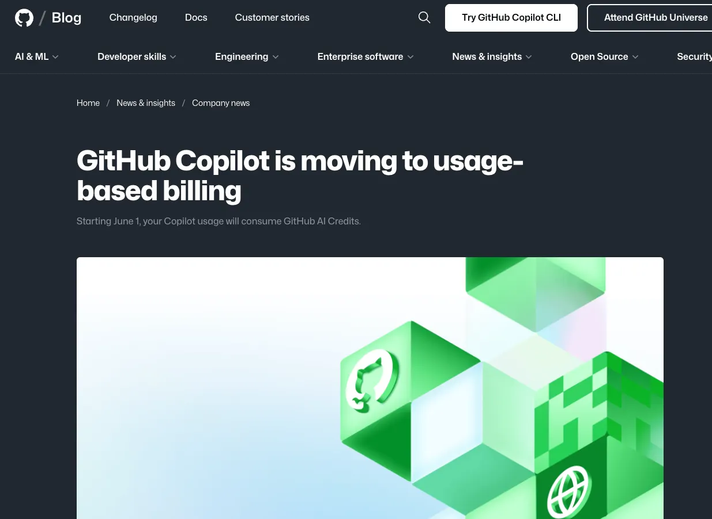
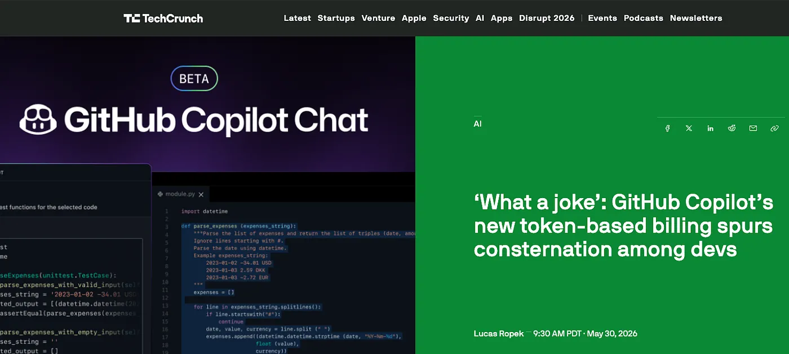
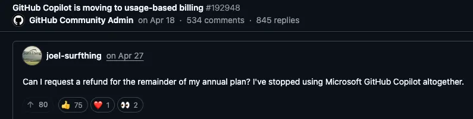
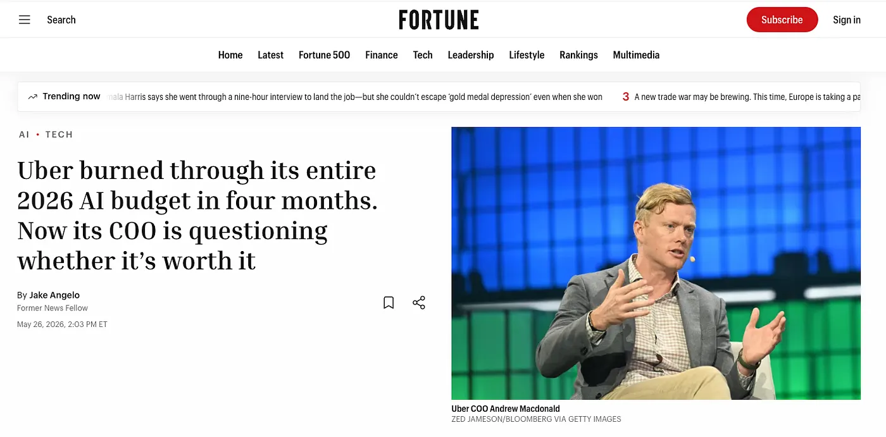

*For three years that price felt real. This spring the real bill arrived, and the industry quietly admitted the cheap years were a subsidy nobody told the customer about.*

<figure>

<figcaption>The sticker said twenty dollars. The actual bill kept printing.</figcaption>
</figure>

On June 1, 2026, GitHub quietly ended an era. It moved every Copilot plan off the flat-rate subscription that had defined the product since launch and onto usage-based billing. The old "premium requests" were replaced with metered GitHub AI Credits, charged by the tokens each interaction burns.

<figure>

<figcaption>GitHub's April announcement: every Copilot plan moves to usage-based billing on June 1, 2026. Source: <a href="https://github.blog/news-insights/company-news/github-copilot-is-moving-to-usage-based-billing/">github.blog</a></figcaption>
</figure>

The headline prices did not change. Pro is still ten dollars a month, Pro+ thirty-nine. What changed is what those dollars buy. Each plan now ships with a wallet of credits, and when the wallet is empty you pay more or you stop. One detail mattered most: the old safety net, where Copilot dropped you to a cheaper model once your requests ran out, is gone. Credits gone now means hands off the keyboard.

<figure>
<blockquote class="twitter-tweet" data-dnt="true"><a href="https://x.com/github/status/2048794729274278258">GitHub (@github) on X</a></blockquote>
<figcaption>GitHub announced the switch on X. The reply section became the backlash. Source: <a href="https://x.com/github/status/2048794729274278258">GitHub</a></figcaption>
</figure>

The reaction was immediate. TechCrunch ran a May 30 piece headlined with one developer's two words, "what a joke," quoting a user whose bill was set to jump from around 29 dollars a month to nearly 750. One Pro+ user reported spending 8 percent of a month's credits in two hours; another said a single change request cost more than 6 dollars and was, in their words, impossible to predict. On GitHub's own thread, developers asked for refunds and said they were leaving. And this was no struggling product: Copilot had crossed 20 million users. The pressure was not coming from the product. It was coming from the thing underneath it.

<figure>

<figcaption>TechCrunch summed up the mood in its headline. Source: <a href="https://techcrunch.com/2026/05/30/what-a-joke-github-copilots-new-token-based-billing-spurs-consternation-among-devs/">TechCrunch</a>, Lucas Ropek, May 30, 2026</figcaption>
</figure>

## The price was always a subsidy

Normal software costs almost nothing to serve to one more user. Large language models break that spell. They cost real money every time they run, and the smarter they get, the more they cost, because the advanced versions do not answer so much as deliberate. An agent that reads files, writes code, runs tests, and tries again can spend in one task what a chat reply spends in a hundred.

<figure>

<figcaption>On GitHub's own announcement thread, one developer asks for a refund and says they've stopped using Copilot altogether. Source: GitHub Community, <a href="https://github.com/orgs/community/discussions/192948">discussion #192948</a></figcaption>
</figure>

So for three years, who paid the gap? Investors did. The twenty-dollar plan was a customer-acquisition subsidy wearing the costume of a price.

> Twenty dollars was never the cost of intelligence. It was the cost of the habit.

That subsidy is no longer a secret. OpenAI expects to lose roughly 14 billion dollars in 2026 and does not anticipate profit until 2029. With the company steering toward the public markets, patience for a permanent loss leader evaporates. Sam Altman has stopped dressing it up, describing a future where intelligence is a utility, like electricity or water, bought on a meter. When the seller compares the dream to the power company, the all-you-can-eat era is over.

<figure>
<blockquote class="twitter-tweet" data-dnt="true"><a href="https://x.com/TheChiefNerd/status/2032012809433723158">The Chief Nerd (@TheChiefNerd) on X</a></blockquote>
<figcaption>Sam Altman at BlackRock&rsquo;s Infrastructure Summit, March 2026, describing intelligence as a utility &ldquo;like electricity or water,&rdquo; sold &ldquo;on a meter.&rdquo; Source: clip via <a href="https://x.com/TheChiefNerd/status/2032012809433723158">@TheChiefNerd</a></figcaption>
</figure>

## The enterprise crater

Individual developers felt this as an irritating charge. Companies felt it as a hole in the floor. Uber burned through its entire 2026 AI coding budget in four months, after usage among its roughly 5,000 engineers jumped from 32 to 84 percent. Its response was a hard cap of 1,500 dollars per engineer per month. And tellingly, Uber's COO admitted the company still cannot draw a clear line from its soaring token spend to anything its riders or drivers actually feel. It was not alone: Microsoft pulled internal Claude Code access from large teams after cost reviews, and Amazon shut down an internal token-usage leaderboard after employees began gaming it.

<figure>

<figcaption>Uber burned its full-year 2026 AI coding budget in four months. Source: <a href="https://fortune.com/2026/05/26/uber-coo-ai-spending-tokens-claude-code/">Fortune</a>, citing The Information and The Verge</figcaption>
</figure>

## The twist: tokens got cheaper, bills went up

Here is what makes this more than a price hike. Per-token prices have actually been falling, and Gartner expects inference to cost around 90 percent less by 2030. So why does every bill keep climbing? Because the way we use these tools changed faster than the price came down. We stopped asking models questions and started handing them whole jobs, and jobs cost job money. Cheaper tokens times a monstrous jump in tokens spent is a bigger invoice, not a smaller one. Flat-rate only ever survived because the typical user nibbled. It cannot survive the day that user points an agent at the whole codebase and walks away.

## The bill, finally

None of this means the tools got worse. They are better than ever, which is what makes it strange. Uber's engineers were not complaining that the agent failed. They were complaining that it worked so well they could not afford to use it the way they wanted to.

For three years a lot of people mistook a venture-funded promotion for the price of intelligence. Twenty dollars was never the cost of the thing. It was the cost of getting an industry hooked on it. That was always going to end the moment someone with a spreadsheet asked the obvious question. The grown-up phase of AI starts the second the number stops surprising you.

---

*Sources: GitHub's [usage-based billing announcement](https://github.blog/news-insights/company-news/github-copilot-is-moving-to-usage-based-billing/) and [community thread](https://github.com/orgs/community/discussions/192948); [TechCrunch (May 30, 2026)](https://techcrunch.com/2026/05/30/what-a-joke-github-copilots-new-token-based-billing-spurs-consternation-among-devs/); [Fortune](https://fortune.com/2026/05/26/uber-coo-ai-spending-tokens-claude-code/), The Information, The Verge, and TheStreet on Uber and OpenAI; Gartner data on AI spend and inference costs. Figures as reported in mid-2026.*
