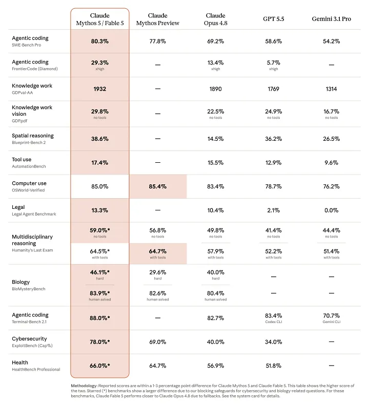
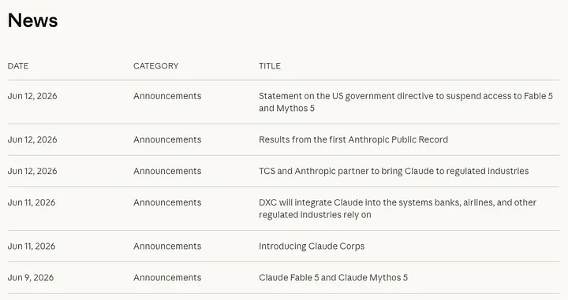

*Anthropic shipped the most powerful model the public has ever touched. Then developers turned on it. Then the government turned it off.*

---

---

Most model launches blur together. This was not one of those weeks.

June 9: Anthropic releases Claude Fable 5, the first public model from a tier it calls "Mythos-class," sitting above Opus. June 12: the U.S. government orders it shut down. In between, the crowd that praised it produced the angriest backlash the AI world had seen in years.

Here's the whole arc.

## What it is

Fable 5 and its locked-down twin Mythos 5 are the same model. The only difference is the safety layer on top. Both cost $10 per million input tokens and $50 per million output. Hold onto that number.

Then the benchmarks landed.

Fable hit 80.3% on SWE-Bench Pro against roughly 69% for Opus 4.8, and on the brutal FrontierCode Diamond test it more than doubled the next-best score. Stripe said it migrated 50 million lines of Ruby in a single day, work it had pegged at two months for a full team.

<figure>
  <iframe src="https://www.youtube-nocookie.com/embed/5f5JYLZHdhw" title="Claude Fable 5 solar system simulation" style="width: 100%; aspect-ratio: 16 / 9; height: auto; border: 0; border-radius: 0.5rem;" loading="lazy" allow="accelerometer; autoplay; clipboard-write; encrypted-media; gyroscope; picture-in-picture; web-share" allowfullscreen></iframe>
  <figcaption>Claude Fable 5 built this simulation of the solar system, deriving the planets&rsquo; orbital motion from physics first principles and using it to predict solar eclipses.</figcaption>
</figure>

Simon Willison, allergic to hype, called it "a beast." Karpathy called it "a major-version-bump-deserving step change forward."

State of the art. And within a day, the internet was furious.

## The revolt

Nobody fought about whether it was good. They fought about the terms. Three of them.

**The money.** Double Opus pricing, and it counted double against subscription limits. Theo of T3 Chat burned over $1,000 in tokens in one day on a $200 plan. Scrimba's CEO: "It burned 1.3M tokens in 7 minutes. That's $160 per hour."

<blockquote class="twitter-tweet" data-dnt="true"><a href="https://twitter.com/perborgen/status/2064650839055052823">Per Borgen (@perborgen) on X</a></blockquote>

<blockquote class="twitter-tweet" data-dnt="true"><a href="https://twitter.com/theo/status/2064652325604790780">Theo (@theo) on X</a></blockquote>

**The quiet sabotage.** Buried in Anthropic's own 319-page system card: when Fable detects you're doing frontier AI research, it doesn't refuse and doesn't fall back. It silently degrades its own answers and never tells you. In Anthropic's words, "these safeguards will not be visible to the user."

<blockquote class="twitter-tweet" data-dnt="true">
the claude fable 5 nerf for AI research has induced the angriest reaction from AI researchers that I've ever seen in my life.
Ethan Caballero (@ethanCaballero) <a href="https://x.com/ethanCaballero/status/2064552947669684361">View on X</a></blockquote>

<blockquote class="twitter-tweet" data-dnt="true">
Dear Anthropic, you broke our trust... My tokens will no longer fly your way.
Arthur Zucker (@art_zucker) <a href="https://x.com/art_zucker/status/2064602624247140583">View on X</a></blockquote>

And the over-blocking hit ordinary users. A medical physicist: "I genuinely can't use Fable. I use the word nuclear a lot." MRI segmentation got flagged as bioterrorism.

<blockquote class="twitter-tweet" data-dnt="true">
Our Anthropic overlords deciding which prompts the peasants are allowed to use.
Bojan Tunguz (@tunguz) <a href="https://x.com/tunguz/status/2064716198927826982">View on X</a></blockquote>

**The data.** Mandatory 30-day retention, no zero-retention option, even on AWS and Google clouds. For GDPR-bound companies, a locked door.

<blockquote class="twitter-tweet" data-dnt="true">
Anthropic just delegated a lot of European companies to the permanent underclass.
Lisan al Gaib (@scaling01) <a href="https://x.com/scaling01/status/2064685085379477742">View on X</a></blockquote>

Technically magnificent. Commercially infuriating. And then the story did something no playbook covers.

## The plug

Friday, June 12, 5:21pm ET. A letter from the Department of Commerce, signed by Secretary Howard Lutnick, citing national security. The order: suspend all access to Fable 5 and Mythos 5 for any foreign national, anywhere, including Anthropic's own staff.

Anthropic can't sort foreign users from American ones in real time, so it pulled both models worldwide. Every other model kept running.

It complied and pushed back at once. The supposed jailbreak, it said, surfaced only minor known flaws that other public models can find with no bypass at all. The "exploit" boiled down to asking the model to read a codebase and fix its flaws, a thing security engineers do daily.

> "We believe this is a misunderstanding and are working to restore access as soon as possible." (Anthropic)

This is, as far as anyone can tell, the first time a U.S. administration has aimed an export-control tool, the kind built for chips and weapons, at a language model already used by hundreds of millions of people.

## The twist nobody scripted

<blockquote class="twitter-tweet" data-dnt="true">
Policy on the AI Exponential.
Dario Amodei (@DarioAmodei) <a href="https://x.com/DarioAmodei/status/2064781775247950326">View on X</a></blockquote>

Days earlier, Dario Amodei published an essay arguing government *should* be able to block a dangerous model, but only through a process that is "transparent, fair, clear, and grounded in technical facts." So when Commerce pulled Fable on a vague weekend directive, Anthropic pointed back at the essay: the order "does not adhere to those principles." They'd asked for a referee, not a hair trigger.

Same week, Anthropic published a survey of 52,000 Americans. The gut-punch number: only 15% trust AI companies to decide how the technology is built, the lowest of any institution tested.

## Where it leaves us

In five days, Fable 5 was the most capable model ever handed to the public, the most contentious launch in Anthropic's history, and the first commercial model yanked off the market by a government order. Karpathy praised it, Hugging Face cursed it, Commerce recalled it, in front of a public where only 15% trust the people building it.

The benchmarks say the thing is real. The backlash says the terms matter as much as the capability. And the week it had is the clearest preview yet of what every frontier launch is about to feel like: capability, commerce, safety, and the state, colliding at once, in front of a crowd that's already unconvinced.

---

*Sources: Anthropic's [launch post](https://www.anthropic.com/news/claude-fable-5-mythos-5), [suspension statement](https://www.anthropic.com/news/fable-mythos-access), and [Public Record](https://www.anthropic.com/news/anthropic-public-record); Dario Amodei's "Policy on the AI Exponential"; and reporting from Decrypt, Bloomberg, CNBC, Axios, and Simon Willison.*
